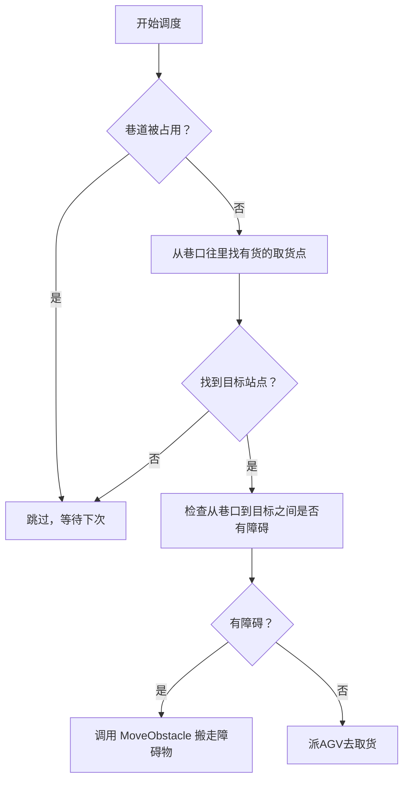

# 巷道与站点调度笔记

# 巷道与站点调度笔记

## 一、巷道基础概念

### 1. 巷道结构（以实际地图为例）

- 每条垂直的站点列被横穿通道分割成上下两个巷道。
- **下巷道**：从底部最深处 → 到横穿通道口  
  例：`3 → 4 → 23 → 24 → 6`
- **上巷道**：从横穿通道口 → 到顶部最深处  
  例：`8 → 25 → 26 → 27 → 28`

### 2. 巷道口与巷底

- **巷道口**：连接横穿通道的站点（如 `6`、`8`）
- **巷底**：最深处，死胡同站点（如 `3`、`28`）

### 3. 判断巷道口的方式

- 看站点的连接路径数：
  - 3+ 条路径 → 巷道口（交叉点）
  - 1 条路径 → 巷底（死胡同）

> 口诀：`OrderStations` 的第一个 = 最深，最后一个 = 巷口

---

## 二、OrderStations 与 Reverse()

### 1. OrderStations（从里到外）

- 顺序：从巷底 → 巷口
- 示例：`[3, 4, 23, 24, 6]`
- 使用场景：
  - 从最深处开始放货
  - 清点库存
  - 避免堵住门口

### 2. Reverse()（从外到里）

- 顺序：从巷口 → 巷底
- 示例：`[6, 24, 23, 4, 3]`
- 使用场景：
  - 从门口开始取货
  - 找空闲站点
  - 提高效率，避免AGV深入巷道

> 口诀：**取货用 Reverse()，放货用 OrderStations**

---

## 三、站点状态判断（四个核心方法）

| 方法 | 含义 | 使用场景 |
|------|------|-----------|
| `IsEmpty()` | 站点是否有货物 | 找空位放货 |
| `AgvOn()` | 是否有AGV停着 | 检查是否有车挡路 |
| `AgvComing()` | 是否有AGV正在驶来 | 路线规划避让 |
| `Tag != null` | 是否被任务锁定 | 防止任务冲突 |

> 组合判断示例：  
> `if (!s.IsEmpty() || s.AgvComing() || s.Tag != null || s.AgvOn())`  
> → 表示该站点不可用（有障碍）

---

## 四、障碍物搬运与巷道锁机制

### 1. 问题根因

- `MoveObstacle()` 没有锁定巷道
- 多个AGV可能同时操作同一巷道 → 竞争条件

### 2. 解决方案：巷道级别互斥锁

#### 修改点（共3处）

| 位置 | 作用 |
|------|------|
| 搬运开始前 | 检查巷道是否已被占用 |
| `agv.Goto(...)` 之前 | 锁定巷道到 `巷道占用表` |
| 搬运完成/异常时 | 释放巷道占用 |

#### 核心代码逻辑（伪代码）

```csharp
// 检查巷道是否被占用
if (巷道占用表.ContainsKey(currentPocketLine)) return;

// 锁定巷道
巷道占用表[currentPocketLine] = agv;

// 搬运完成后释放
var key = 巷道占用表.FirstOrDefault(x => x.Value == agv).Key;
if (key != null) 巷道占用表.Remove(key);
```

### 3. 效果

- 同一时刻，同一巷道只允许一个AGV操作（取货、放货、搬障碍物）
- 与 `AssignAgvTask()` 中的巷道占用检查协同工作

---

## 五、调度流程（AssignAgvTask）



---

## 六、总结速查表

| 概念 | 含义 | 项目中的对应 |
|------|------|----------------|
| 巷道 | 从死胡同到横穿通道的一列站点 | 如 `3→4→23→24→6` |
| OrderStations | 从最深到门口 | 放货从里往外 |
| Reverse() | 从门口到最深 | 取货从外往里 |
| 巷道口 | 连接主路的站点 | 如 `6`、`8`、`31`、`39` |
| IsEmpty() | 站点是否为空 | 找空位放货 |
| AgvOn() | 是否有AGV停着 | 检查挡路 |
| AgvComing() | 是否有AGV正驶来 | 路线避让 |
| Tag | 是否被任务锁定 | 防止任务冲突 |
```

你可以将上面的内容复制保存为 `巷道调度笔记.md` 文件。如果需要我帮你直接生成下载链接，也可以告诉我。